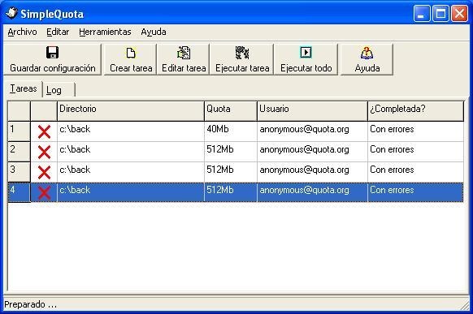

# SimpleQuota

**SimpleQuota** calcula tamaños de los directorios configurados, enviando un *e-mail* a aquellos usuarios avisando en el caso de que el tamaño de los archivos en dicho directorio supere la cuota asignada.

Se parte de un archivo de texto de configuración, en el que por cada línea se especifica una carpeta, un máximo de ocupación y una dirección de *e-mail*. **SimpleQuota** contabiliza lo que ocupa cada directorio (y todos sus subdirectorios) y, en caso de sobrepasar la cuota o un 80'% de la misma, envía un correo electrónico al usuario para avisarle de la situación.

Es posible añadir **SimpleQuota** al planificador de programas de Windows, consiguiendo que la tarea se ejecute de manera automática y regular.

[Obtener la última versión](https://github.com/Baltasarq/SimpleQuota/releases "Release").

[Ver](https://github.com/Baltasarq/SimpleQuota/ "SimpleQuota en GitHub") en [GitHub](https://www.github.com/ "GitHub").

&copy; 2007 [baltasarq](http://baltasarq.info/ "baltasarq home") [MIT License](http://www.opensource.org/licenses/MIT "MIT License").
